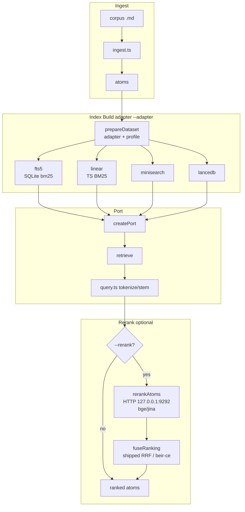

<!-- LLM-PRIMARY: Entry point for all dp-gnosis work — retrieval architecture + data flow, the OPEN landmines, the served path, and what is settled. Benchmarking (flags, layers, provenance, metrics, harness gaps) is in GNOSIS-BENCH.md; resolved defects and the research index in GNOSIS-HISTORY.md; measured numbers in GNOSIS-BASELINES.md; the typed path in GNOSIS-DATA-FLOW.md. Read this FIRST before any work on packages/gnosis/ or packages/gnosis-bench/. -->

# Gnosis Guide — the single entry point

The retrieval-development CLAUDE.md. **Read this FIRST** before any work on `packages/gnosis/` (the engine) or `packages/gnosis-bench/` (the benchmark) — develop, debug, investigate, tune, or review.

MUST NOT open engine source, launch a benchmark, or hand-roll an `npx vitest` / `grep -rn` pipeline before routing through this file. `tools/` is NOT in the project snapshot — `snapshot:query` returns nothing here; orient from this guide and the two package READMEs.

**What belongs in this file.** Architecture, rules, landmines, and measured **baselines**. A volatile fact MUST be **routed to its source of truth, never restated here** — a copied count rots silently, and restated counts have repeatedly gone wrong in this file — manifest size, gate totals, and the landmine tally were each stale at the same time.

| Volatile fact | Ask this instead |
|---|---|
| Which datasets exist; their `layers`, `enabled`, `format`, `source` | `packages/gnosis-bench/datasets.json` — the manifest is the ONLY owner |
| Dependency versions | the two `package.json` files |
| Test counts | run the command; a number here would be stale by the next commit |
| Where a symbol lives | `grep -n "export const <name>"` or LSP `workspaceSymbol`. **Code is cited by SYMBOL, never by line number** |

## What dp-gnosis is (and is not)

| | |
|---|---|
| Is | Lexical BM25 retrieval over a vault of markdown **atoms** — one document chunked into frontmatter-tagged units. No server, no network at query time |
| Is NOT | **Semantic retrieval AS SHIPPED.** A dense path EXISTS but is NOT deployed: `lancedb-vec` and `lancedb-hybrid` were built and measured in Phase D. **The old reason given here — "they lose to query rephrasing" — is FALSIFIED on both halves** (§ Settled): rephrasing is measured INERT at prompt v2, and dense measures **+0.0358 nDCG@10 (p=0.0001)** on `arguana` where its sign flips positive. The live reason it is not shipped is narrower: every dense win is FIRST-STAGE and unproven through the reranker, and it costs an embedding server, a 1.1 GB model, a vector column, a cache and a fusion path. The four lexical adapters remain the only production routes; `lancedb` itself is still full-text BM25 only, frozen, with no vector column |
| The optional hops, and the one lever that is ON | `--rerank` — a cross-encoder over HTTP at `127.0.0.1:9292`, opt-in; `--rephrase` — a chat model on the same server rewriting the query before the first pass, opt-in and measured inert. **`--prf` (RM3 pseudo-relevance feedback) is NOT a network hop and is ON BY DEFAULT on the shipped profiles since 2026-08-22** — pure SQLite over fts5's own scorer, turned off with `--no-prf`. It is the only lever whose default is ON, and every expanded run reports the cell it used |
| The largest measured quality lever | **Query phrasing**, not adapter choice. MUST rewrite a natural-language question to keywords before every `retrieve`. The rule and its language split live where callers execute it — `packages/gnosis/README.md` § Query rephrasing. Measured effect: `GNOSIS-BASELINES.md` |

## Pick your door

This file is the CORE: architecture, open landmines, the served path, what is settled. Three siblings carry the rest — route, do not read them all.

| I want to… | Go to |
|---|---|
| Understand the pipeline / place a change | § Architecture + § Landmines below, then `GNOSIS-DATA-FLOW.md` for the hop a change belongs to |
| Run a benchmark, read its output, or pick a metric | `GNOSIS-BENCH.md` |
| Know what the harness CANNOT see | `GNOSIS-BENCH.md` § Known harness gaps |
| Orient on where quality stands today | `GNOSIS-BASELINES.md` — a SNAPSHOT, never a gate |
| Know what has already been ruled out | § Settled — MUST NOT retry |
| Plan retrieval-quality work, or find prior research | `GNOSIS-HISTORY.md` § Research index — the OPEN plans are named there |
| Interpret a run recorded BEFORE a fix | `GNOSIS-HISTORY.md` |
| Use the CLI, author an atom, or fix retrievability | `packages/gnosis/README.md` (CLI contract, exit codes, profiles, authoring rules) |
| Hand a consumer ONE citable knowledge pack | `answer <query…>` — same pipeline and flags as `retrieve`, rendered as one delimited block with `[^atom-id]` citations. `packages/gnosis/README.md` § `answer`. It is what the `dp-gnosis-search` skill calls and what the runner's knowledge block wraps |
| Get a WRITTEN answer over that pack, not just the atoms | `answer --synthesize` — opt-in 27B hop; a fabricated citation discards the answer and exits 3. `packages/gnosis/README.md` § `--synthesize` |

## Architecture — the data flow

**Query rephrasing is a SECOND optional network hop, before the first pass.** `retrieve --rephrase` (`rephrase.ts`) rewrites the question into a BM25 keyword line with a local chat model on the same llama-swap instance as the reranker, then retrieves — and reranks — with the rewrite; `query` is still reported as typed, with the rewrite beside it as `queryRewritten`. It is **opt-in and off by default**, so the default path is byte-identical to what every recorded number was measured on, and it is **cached on disk** by `(model, prompt version, query)` beside the index, so a repeated query costs no network. A refusal (server down / model not served / no usable line) retrieves with the RAW query and exits 3 — never silently.

**Routing:** Adapter is selected at `createPort` via `--adapter` CLI flag, default `fts5` on BOTH the CLI and the bench since `92d683e2` (they are asserted equal by `defaults.test.ts`); `openPort` rejects indexes prepared for a different adapter. `prepareDataset` is driven by the chosen adapter + dataset profile from `datasets.json` / `corpus-manifest.json` and writes a per-adapter artifact under its own parent dir. Query analysis is always `query.ts tokenize + stemText` / `stemmer` for all adapters. Rerank is gated by `--rerank` flag and server reachability at `RERANK_DEFAULT_URL http://127.0.0.1:9292`. When enabled, `rerankAtoms` calls a cross-encoder named by `--rerank-model` (default `qwen3-reranker-4b` since `92d683e2` — it IS the measured quality winner; `bge-reranker-v2-m3` was the default before that and every pre-`92d683e2` rerank row carries it); fusion is chosen by `--rerank-profile` `shipped` = RRF with `RERANK_RRF_K=20` / `RERANK_RRF_WEIGHT=0.75`, `beir-ce` = pure reranker order replacement. No deterministic rerank alternative exists — rerank is the only network hop in the RANKING path (`--rephrase` is the other one, and it sits before the first pass).

| Stage | Symbol | Contract |
|---|---|---|
| path exclusion | `isExcluded` → `loadCorpus` (`ingest.ts`) | Drops a source whose repo-relative path starts with any profile `excludePaths` prefix, **before read and chunk** — so an excluded file enters no count and no `skipped[]`. Directory prefixes MUST carry a trailing slash, or `startsWith` claims siblings |
| ingest | `ingest` (`ingest.ts`) | Chunks each source doc into atoms; `writeManifest` writes `corpus-manifest.json` to `dirname(outputDir)` |
| body dedupe | `bodyKey` / `firstByBody` (`ingest.ts`) | sha1 of the body with its heading line stripped (hashing the composed body would miss mirrors whose heading differs); bodies ≥ `DEDUPE_MIN_BODY_CHARS`. Keeps the FIRST by sorted source path, skips the rest with reason `duplicate-body-of:<id>`. Counted separately from `skipped` on `IngestSummary.duplicates` and in the manifest |
| id resolution | `duplicatesOf` → `resolveId` (`ingest.ts`) | O(n²); on collision it appends a fingerprint suffix and **NEVER discards** an atom |
| write guard | `roundTripError` (`validate.ts`) | Ingest MUST NOT write an atom its own parser refuses. Asks the parser (`parseAtom(serializeAtom(…))`) rather than re-checking fields, so it cannot drift. ~4.2 µs/atom |
| heading composition | `withHeading` (`chunker.ts`) → `bodyWithHeading` (`ingest.ts`) | A chunk starts *after* its heading line, then the heading is **re-added** — so a heading's terms ARE indexed. Exception: if the prefixed body would exceed `bodyMaxChars` the heading is dropped, the only case where they are genuinely unsearchable |
| empty-body drop | `emptyBodyReasons` (`ingest.ts`) | An atom whose body is empty after comment-stripping is discarded with a reason. It tests the **heading-stripped** chunk body, not the string the index reads — see § Settled |
| index build | per adapter, via `prepareDataset` | Each adapter gets the index IT needs; `openPort` REFUSES an index prepared for another adapter |
| port | `createPort(adapter, atomsDir, indexPath)` (`cli/adapter.ts`) | One bare port per adapter — JSON schema and exit codes cannot diverge per adapter |
| retrieve | `port.retrieve(rawQueryText, {k})` (`port.ts`) | Takes **RAW query text**; `toMatchExpression` (`fts5Adapter.ts`) tokenizes and stems |
| rerank | `rerankAtoms(query, atoms, baseUrl)` (`rerank.ts`) | Cross-encoder + fusion; refuses loudly when the server is down |

**The same path, typed hop by hop — which hop a change belongs to, and what a tokenizer change must touch: `GNOSIS-DATA-FLOW.md`.** Read it before changing analysis, chunking or the rerank protocol.

### Adapters — all lexical

`ADAPTER_NAMES` holds **seven** entries — the four lexical ones below plus the three dense routes — and `DEFAULT_ADAPTER = 'fts5'` (`cli/adapter.ts`), asserted equal to the bench default by `tests/defaults.test.ts`. The sweep is fixed at `linear` (it is the only tunable one). **Corrected 2026-08-18**: this line previously read `['linear','fts5','minisearch','lancedb']` and `DEFAULT_ADAPTER = 'linear'`, contradicting § Architecture in this same file — read the constant, never this sentence.

| Adapter | Role | Tunable? |
|---|---|---|
| `linear` | Reference BM25 in TypeScript. Exact but slow — `scanCorpus` re-reads the corpus on every retrieve unless `cacheCorpusScan` is set, and it is set ONLY by the sweep | **Yes** — `BM25_K1=1.2` / `BM25_B=0.75` (`linearScanAdapter.ts`) |
| `fts5` | **Production.** **CORRECTED 2026-08-24 — this row read "SINGLE-COLUMN … so column weighting is impossible without a schema change" and that is STALE.** The schema change already landed: `FTS_COLUMNS` (`config.ts`) declares **seven** columns — `body, short, long, doc_desc, keywords, entities, questions` — and `--field-weights` merges over `DEFAULT_FIELD_WEIGHTS`, which is `body: 1` with **every enrichment column at 0**. So the served ranking is body-only *by weight*, not by schema, and column weighting is a flag away. That zero default is why the schema change moved no recorded number: `vault`, `vault-hu` and `scifact` re-run **byte-identical** across it. Tokenizer `unicode61`; `stemText` applied BOTH index-side and query-side | **Partly** — the BM25 k1/b are still compiled into SQLite with no setter, but the per-column weights ARE tunable via `--field-weights` |
| `minisearch` | Optional dep — its own defaults, tokenizer and field setup | boost / fuzzy / prefix all unset |
| `lancedb` | LanceDB full-text (BM25) path ONLY — a v2-readiness probe, **no embeddings, no vector column**, and deliberately FROZEN so its recorded baseline stays reproducible. `FTS_INDEX_OPTIONS` now sets `maxTokenLength` explicitly; unset, LanceDB silently DROPPED every token of ≥40 characters, which `fts5` keeps | FTS index options in `lanceDbAdapter.ts` |
| `lancedb-vec` | **Dense only** — `bge-m3` embeddings of the RAW body, exhaustive cosine (`bypassVectorIndex()`, no ANN). The Phase D control. **Measured HARMFUL on English** (−0.1621 nDCG@10, p=0.0001) | Embedding model / pooling, served by llama-swap |
| `lancedb-hybrid` | **Dense ⊕ lexical**, fused by `fuseLegs` (`rerank.ts`) — never LanceDB's `RRFReranker`. At `--hybrid-weight 0.25` it TIES `fts5` on both corpora; at the old inherited 0.5 it looked like an English regression. Still **loses to query rephrasing**. NOT shipped | **`--hybrid-weight` (SWEPT — best 0.25 on English, flat 0.25–0.75 on Hungarian)** |
| `lancedb-hybrid-full` | Same fusion, but offers the reranker the **whole ~1.6×`k` union** instead of the fused top-`k`. Raises recall exactly as forecast and converts none of it (null on all three corpora) at 1.64× rerank cost. Exists as recorded evidence, NOT as a route to use | `--hybrid-weight`, as above |

**MUST NOT read an adapter comparison as a scorer comparison.** The four differ in BM25 parameters, tokenizer AND field setup, so the suite answers *"which implementation performs best as shipped"*, never *"which scorer is better"*. `linear` additionally tokenizes `frontmatter.title` while `fts5` indexes `atom.body` alone; the resulting offset **flips sign** across corpora (+0.0192 on bright passages, −0.0384 on bright-biology, **+0.0438** on `vault-hu`) and the title-field hypothesis was tested by direct experiment and **refuted** as its explanation.

### Rerank — the fusion RULE is a parameter, the rest are shipped constants

`config.ts` owns `RERANK_DEFAULT_URL='http://127.0.0.1:9292'`, `RERANK_K_INIT=100` (was 20 before `92d683e2`), `RERANK_RRF_K=20`, **`RERANK_RRF_WEIGHT=0.75`** (was 0.5 until 2026-08-19 — T1.5c-adopt, owner-approved on a pre-registered held-out arm; **every row recorded before that carries 0.5**), and `HYBRID_DENSE_LEG_WEIGHT=0.5`. `K_INIT` and the URL cannot be passed by a caller.

**`HYBRID_DENSE_LEG_WEIGHT` is the hybrid route's dense-leg share, and it is its OWN binding.** It reads 0.5 — the value every recorded `lancedb-hybrid` row was measured at — but it is no longer derived from `RERANK_RRF_WEIGHT`, so tuning the reranker's RRF weight can no longer move the leg fusion as a side effect. The two are different fusions and MUST NOT be conflated. The value is deliberately unchanged despite `w=0.25` measuring better on English: the route is not shipped, and moving it would make new rows non-comparable with every recorded one.

**The fusion rule CAN be selected, by name.** Two presets, a two-member discriminated union — deliberately not a pluggable strategy registry:

| Preset | Rule | Use |
|---|---|---|
| `shipped` (default) | RRF over `RERANK_RRF_K` / `RERANK_RRF_WEIGHT`. **NOT bit-identical across 2026-08-19**: the weight moved 0.5 → 0.75, so a `shipped` row recorded before that does NOT reproduce today. `compare.ts` backfills an absent `rerankWeight` to 0.5 and labels the pair `ARM COMPARISON` rather than subtracting it | What the product serves |
| `beir-ce` | **Pure replacement** of the first-pass order by the reranker's order | What the published BEIR BM25+CE baseline does — use it to compare against published numbers |

Both rerank the **same pool** at the same depth and cost the same; they differ ONLY in how the two orders are combined. `resolveRerankFusion` refuses an unknown name rather than falling back — a silent fallback would publish a number under the wrong label. `rerankProfile` / `rerankWeight` are `TREATMENT_FIELDS`, so `--compare` labels a fusion change `ARM COMPARISON` instead of subtracting it.

**`RERANK_K_INIT` is a FLOOR, not a cap.** `retrieveCommand.ts` resolves the first pass as `Math.max(request.k, RERANK_K_INIT)`, so the reranked pool is `max(k, 100)` since `92d683e2` — the constant binds every caller asking for FEWER than 100, which is now the common case. A caller asking `-k 200` reranks 200. MUST NOT read "the reranker sees `k`" as a property of the pipeline; below the floor the pool is the floor, and that costs ~12 s/query (BASELINES § Serving path).

RRF is `score(d) = w/(K + rank_rerank(d)) + (1−w)/(K + rank_bm25(d))`. Served models: `bge-reranker-v2-m3`, `qwen3-reranker-0.6b`, `qwen3-reranker-4b`, `ettin-reranker-1b-v1` (all verified rank heads; `ettin` passes the probe but is a measured quality REGRESSION on English — `GNOSIS-BASELINES.md`), plus `jina-reranker-v3` / `v3.5`, which are served but **UNUSABLE — their ranking head is absent from the GGUF entirely, and they are listwise models called through a pairwise API** (§ Landmines). No build change fixes that. `jina-reranker-v2-base-multilingual` was **retired 2026-08-16** — its trained context is 1024 and it cannot score a full-length atom. Changing `K_INIT` or the URL means editing `config.ts` and taking a NEW baseline.

**Reranker per-pair window — 8192 tokens since 2026-08-19 (`-np 1`); it was 1536 for one day.** The cap applies per (query, document) pair, so batching is irrelevant to it. Measured bracket on `qwen3-reranker-4b` after the restore: **6382 tokens → HTTP 200, 8482 → HTTP 500**. `RERANK_DOC_MAX_CHARS = 2000` (worst English atom 1471 tokens) now sits at ~18 % of the window and **4000 is servable** — T1.4b is unblocked.

Three standing rules this episode produced:
- MUST re-probe the window before raising `RERANK_DOC_MAX_CHARS`, lengthening the query, or changing `-np` — read it off the server, never off `-c` or the display name.
- The over-window refusal above 8192 is a `-b`/`-ub` batch **`server_error`**, NOT the `exceed_context_size_error` that `singleRerank` bisects on. Inert while `ATOM_MAX_CHARS = 4000` (≈2840 tokens worst case) caps every document below it; a real gap the moment anything exceeds 8192.
- `~/.config/llama-swap/config.yaml` carries a `GENERATED by generate.py` header and **had been hand-edited** to add `-np 6` while `generate.py:241` still emitted `-np 1`. MUST change the generator and regenerate; a hand edit drifts silently and is what cost the day.

**Both scores survive the fusion now.** `rerankAtoms` used to end with `fused.map(e => ({...e.item, score: e.score}))` — it overwrote the first-pass score with the fused one and threw the cross-encoder's own score away, so a caller could not tell an atom the reranker AGREED with from one it rescued, and the only number it could read was an RRF rank sum with no scale. A reranked `RetrievedAtom` now carries `firstPassScore` and `rerankScore` beside `score`; `score` still holds the FUSED value and the order is still taken from it. The raw score rides the atom through the sort by identity, `fuseRanking`'s signature and arithmetic are untouched, and the ranking is **byte-identical** with and without the fields — `tests/retrieveExplain.test.ts` pairs the reranked order against `fuseRanking` itself as the oracle. Both fields are ABSENT on a non-reranked run rather than defaulted, so their presence is what says a rerank happened; the CLI also reports `poolSize`, the first-pass size the reranker actually scored. `rerankScore` is the field an abstain rule should read — it is the only one with an absolute scale, and since T3.1a that scale is MEASURED per model. `RERANK_CALIBRATION` (`config.ts`) maps a served reranker to `identity` or `sigmoid`, and `calibrate(model, raw)` (`rerank.ts`) turns a raw score into a probability or returns `undefined` for a model with no measured scale — no default, because guessing is silent in both directions (`identity` on a logit model yields `p = 5.06`; `sigmoid` on a probability squashes everything into [0.5, 0.73]). Probed 2026-08-19 over one query with a relevant, a partial and an unrelated document: `qwen3-reranker-4b` 0.99972/0.32028/0.0000039 and `qwen3-reranker-0.6b` 0.99973/0.94059/0.00012 are probabilities; `bge-reranker-v2-m3` 5.0632/−0.1369/−10.9998 and `ettin-reranker-1b-v1` 2.4520/0.8657/−0.2419 are logits — a negative score cannot be a probability, so those two are proved rather than assumed. `llama-nemotron-rerank-1b-v2` failed to load and is deliberately absent.

**The BANDS are still uncalibrated, and the CLI is built to say so.** `retrieve` reports `confidence ∈ {none, weak, ok}`: `none` = nothing delivered, `ok` = a floor is in effect AND the top-1 calibrated `p` clears it, `weak` = everything else. `--min-relevance 
` is the only floor that exists and it is OPT-IN, so **`ok` is unreachable on a default run by design** until T3.1b measures the distributions and picks a floor at best F1. The floor is strictly subtractive — applied after the rerank and the `-k` slice, it never reorders, never promotes an atom from deeper in the pool and never moves `poolSize` — and it REFUSES (exit 2) on an out-of-range value, without `--rerank`, or on a reranker absent from the table.

**Fusion exists in exactly ONE place**: `fuseRanking` (`rerank.ts`) fuses the reranker order with the first-pass order of a **single** adapter. There is no cross-adapter fusion. The bench passes a fusion NAME through `engine.ts`; it MUST NOT reimplement fusion, or the suite would stop measuring the real engine.

### Libraries

Required: `better-sqlite3`, `stemmer`. Optional (gate `minisearch` / `lancedb`): `@lancedb/lancedb`, `apache-arrow`, `minisearch`. Bench-only: `hyparquet` (BRIGHT parquet fetch — `docs/adrs/ADR-036-dep-hyparquet.md`). Versions: the two `package.json` files.

## Landmines — silent failures, each verified

**The recurring failure class in this project is: a component produced nothing, and the pipeline recorded it as data.** MUST treat any all-zero metric row, any `p=1.0000`, and any zero-width CI as a defect until proven otherwise — never as a finding.

**The worst instance failed toward a PLAUSIBLE number, not an obvious zero** — which is why the earlier defects were caught quickly and that one survived a whole campaign. A number that looks reasonable is not evidence that the pipeline is sound.

| Landmine | Mechanism | Rule |
|---|---|---|
| **~~Frozen atom domain vocabulary~~ — MECHANISM DEAD, RULE KEPT (corrected 2026-08-22)** | This row used to say an unknown domain *"writes atoms then silently drops every one at index time — empty index, zero results, NO error anywhere"*. The index-side `asDomain` re-check was **removed at T6.2** (`config.ts`'s own `ATOM_DOMAINS` docblock says why: it dropped other profiles' atoms with no diagnostic), and `grep -rn asDomain src/` reaches **no adapter**. **Refuted by execution**: the `hu-tax` profile declares a domain the shipped default has never heard of, and a real ingest + index gave **454 atoms → a 348 160-byte fts5 index → correct results**. A new domain arrives as DATA, in a profile file, with no TypeScript edit | **A new corpus does NOT need a shipped domain.** The RULE survives its mechanism: any new harness MUST still assert the index is non-empty — that assertion is what caught this. `16` § 5 C8, `07-plan.md` § 6.72 |
| **`ingest` invalidates the index and NOTHING says so — the served path dies silently while every gate stays green** | `ingest` restamps `corpus-manifest.json`'s digest and exits 0. The index beside it still carries the OLD digest, so the next `retrieve` refuses with exit 3, `indexState: "mismatched"`, `count: 0`. The refusal is correct and names its remedy — but no gate queries the production index, so a suite can be 100 % green over a vault that answers nothing. Measured 2026-08-22: the D24 repair ran `ingest` alone and left the served CLI refusing | **Every `ingest` MUST be followed by `npm run gnosis -- index --adapter fts5`** — they are one operation in two commands, and the second half is the half that is forgotten. After ANY corpus repair or profile change, run ONE real `retrieve` and read `indexState` before believing the vault is served. `16` § 4 D25 |
| **A stale untracked cache reads exactly like a code defect** | Atom caches are gitignored and regenerable, so nothing dates or diffs them. A cache three days behind the producer presented as TWO convincing code defects (144 unparseable atoms + 18.8% "drifted" gold) and cost a full investigation | **Check the mtime of any untracked derived artefact BEFORE reading its contents as evidence** |
| **Shared work directory destroys corpora** | `writeManifest` writes `corpus-manifest.json` to `dirname(outputDir)`; `claimOutputDir` / `pruneOrphans` wipe an atoms dir another profile owns | Every dataset/profile MUST get its OWN parent directory and its own `indexPath` |
| **The CLI and the bench search DIFFERENT type sets — but NOT in the direction this row used to state (corrected 2026-08-22)** | An unfiltered CLI `retrieve` subtracts the profile's `defaultExcludedTypes` (`config.ts:DEFAULT_EXCLUDED_TYPES`, applied in `retrieveCommand.ts`). **The bench subtracts the SAME four types from the DERIVED datasets** — `run.ts:typeFilterOf(includeHistory)` feeds `ensureVaultDataset`, and `--include-history` is off by default, so `vault` derives **6787 of the vault's 14706 atoms** and every history row stamps `typeFilter: "benchmark,brainstorm,feature-log,review"`. This row previously read *"the bench calls `port.retrieve` directly and never enters CLI flag resolution, so it measures the FULL corpus"*; that is TRUE of a non-derived dataset (`nfcorpus`, `scifact`, BRIGHT) and FALSE of `vault` / `vault-hu`. `profiles/default.profile.json`'s `comment:defaultExcludedTypes` carries the same stale claim. `16` § 5 C7 | MUST NOT read a CLI result as reproducing a bench number, or the reverse — and **`--include-history` does NOT make them comparable** (corrected again 2026-08-22, C9). The two subtract the SAME four types; what differs is WHERE. The CLI keeps ONE index over the whole vault and drops the excluded types as a POST-scoring survivor filter (`fts5Adapter.ts:matchType` inside `readUntilSettled`), so BM25 statistics are the full 14 706 atoms'. The bench builds a SEPARATE index over the 6 787 survivors, so its IDF and avgdl are that corpus's. Same documents, different collection statistics ⇒ different scores. **MEASURED on `q-001` against the pinned BM25 `.trec`**: at `--no-prf` the CLI returns the same ten atoms with ranks 3/4/5 permuted; at the served default (PRF on, which the bench does not read at all) the MEMBERSHIP moves too. `--include-history` widens the CLI's set to all 15 types and moves it FURTHER from the bench. `16` § 5 C9. The exclusion is a PRESENTATION default, never a corpus change — the types stay ingested and indexed, so no recorded number moved when it landed. Read the shipped set from `profiles/default.profile.json`, never from memory |
| **Ingest dedupe silently orphans a gold id, and the fix MOVES the gold document** | Exact-body dedupe keeps the first of a byte-identical group by sorted source path. When the golden set judged the copy that lost, its id vanishes: measured at T2.1, 19 of 283 `vault` gold ids, coverage 100 % → 93.29 %, and `fetch/vault.ts` derive then REFUSES the dataset. Re-pointing the id looks mechanical because the bodies are identical — but scoring is DOCUMENT-level (atom → `originPaths[0]` basename), so it swaps which SOURCE FILE is gold | Any corpus-hygiene change MUST re-check golden coverage before its baseline arm, and MUST record the from→to mapping rather than editing goldens in passing — the golden set is the measuring instrument. Worked example and the 1:1 mapping: `docs/analysis/2026-08-19-t21-corpus-v2-gold-repoint.md` |
| **Pre-tokenizing the query** | `port.retrieve` takes RAW text and the adapter stems it | MUST NOT pre-tokenize or pre-stem before `retrieve` — it measures a path production never takes |
| **`fitToTokenBudget` before scoring** | It is the CLI's PRESENTATION cap (`budget.ts`) and truncates the ranking | MUST NOT apply it before scoring. ONE exception, opt-in: behind `--budget` it is applied in `run.ts:rankTopic` AFTER the rerank — a measured presentation arm, labelled by `tokenBudget` / `servedK`. Applying it in `engine.ts:retrieveDocs` would cap the RERANKER'S POOL instead, which `rerankPool` exists to keep visible |
| **Wrong vitest config finds zero tests** | The root vitest config does NOT collect either suite. `npx vitest run packages/gnosis-bench` silently passes with **zero tests** | Bench: `npx vitest run --config vitest.tools.config.ts packages/gnosis-bench`. Engine: `npm run gnosis:test`. Read the count off the run, never off a doc |
| **Concurrent suites flake** | Observed once (2026-08-15): `gnosis:test` reported 2 failures while the bench suite ran concurrently, then 501/501 green alone, same tree. Cause NOT confirmed — a shared work directory is the obvious suspect but was not proven | Run the two suites SEQUENTIALLY before believing a red |
| **A cold reranker load fails the whole arm** | llama-swap loads a model on demand. The first `/v1/rerank` call after eviction took **1 m 59 s** on a direct probe — past the client's abort. `--rerank` then FAILS the dataset (correctly: it never falls back to BM25 order), costing the arm, not one query | MUST warm the reranker with one direct `/v1/rerank` call before launching a rerank arm, and MUST keep arms back-to-back so the model cannot idle out between them |
| **A reranker's `-ub` cap is PER DOCUMENT, and a batch probe cannot detect it** | `-ub` caps each query-document pair, NOT the request — batching itself works fine. A probe of two ~910-token documents returns HTTP 200 with `usage.prompt_tokens: 1820`; reading that sum as "the cap is above 1820" is WRONG and wrongly cleared a known blocker. A single 1404-token document on the same server returns HTTP 500 | MUST probe a reranker cap with ONE document longer than the suspected limit. MUST NOT infer headroom from a batch `prompt_tokens` total. Serve every rerank arm at the SAME per-pair window — an arm that truncates a document another sees whole is not a model difference. **Read the current window from § Reranker per-pair window before every arm; it has moved once already** |
| **The served per-pair window is NOT `-c`, and the model's display name lies** | llama.cpp divides `-c` across `-np` slots while the llama-swap display name keeps reading `ctx=8192, ub=8192`. At `-c 8192 -np 6` the real window was **1536** (8192/6 padded) and width 4000 REFUSED real documents on BOTH corpora (≥105 of 200 probed `vault`, 5 of 86 `vault-hu`; `n_prompt` up to 2833). `assertDocumentFits` compares `Buffer.byteLength` to `MAX_BATCH_TOKENS = 8000`, so it CANNOT fire before the server does. Restored to `-np 1` 2026-08-19; the display name was right again by accident, not by construction | MUST read the window off the server, never off `-c` or the display name: post ONE over-long document and read the refusal payload (`n_ctx` on an `exceed_context_size_error`, the batch size on a `server_error`). MUST NOT assume `ATOM_MAX_CHARS` is servable |
| **A recorded champion is bit-reproducible only WITHIN one serving config — and `-np` is part of that config** — CAUSE CONFIRMED 2026-08-19 (T1.6b) | G-W1: the champion re-run scored `vault` 0.5040 → 0.5012 and `vault-hu` 0.6929 → 0.6924, rankings differing on 50 of 60 and 31 of 31 topics, while a SECOND run at the same sha and server was byte-identical. R@100 and R@10 were unchanged, so the first stage and top-10 membership were bit-identical and only the ORDER WITHIN moved. **The decider has since run**: at `-np 1` / window 8192 the `vault-hu` champion arm returns 0.6929 and its `.trec` is **byte-identical to the champion recorded 60 commits earlier** (12 of them touching `packages/gnosis/src`), and differs from the `-np 6` run on 1246 lines. So the divergence was the SERVING CONFIG, never non-determinism and never a code regression | The reranker is deterministic at a fixed sha AND a fixed serving config — and, measured, across a large sha delta at a fixed serving config. **`.trec` byte-identity IS a valid acceptance criterion within one serving config** (T1.1's clause and T6.3's gate stand); across a serving-config change it MUST NOT be used — use a paired test against a stated tolerance. Read § Reranker per-pair window before every arm; `-np` has moved once already. BASELINES § The `-np` decider |
| **The analysis chain is NOT idempotent** | `analyze(analyze(x)) ≠ analyze(x)` for **822 of 19 098** `nfcorpus` index terms (4.3 %): `abus`→`abu`, `accident`→`accid`. A term read OUT of the index is already analysed, so re-entering it through `toMatchExpression` searches for a string that is NOT in the index — zero rows, zero weight, no error | Any term read back out of an index MUST re-enter through a path that does NOT re-analyse (`toAnalyzedMatchExpression`). Binds PRF, doc2query, term-level explain, vocabulary diagnostics |
| **A read-only audit that re-runs ingest DESTROYS the corpus it audits** | A gold-audit tool re-ran `ingest` into the dataset's REAL `atomsDir`; `ingest` writes AND prunes, so `vault` went **6628 → 6619 atoms**, silently dropping 9 judged documents. Every recorded row was measured at 6628. Caught only because a re-scored nDCG moved **−0.0013**, a direction impossible under the stated model | A tool that re-runs a production stage MUST ingest into a throwaway directory, and MUST pass that stage's production inputs (`goldIds`) — re-running ingest without them is not "the same ingest". **A Δ whose SIGN is impossible under the model is a defect signal regardless of magnitude** |
| **A hand-rolled `history.jsonl` join silently spans a corpus boundary** | Joining recorded runs on `depth`/`rerankModel` alone produced a large, plausible, entirely fictional cross-adapter result — the adapter rows were corpus v1 (11 345 atoms) and the `fts5` rows v2 (6 628). The same error one layer deeper changed a published conclusion: `arguana` moved 8699 → 8591 atoms, and its attribution went from 13.3 % to **38.0 %** of missed gold outside the top-100 | An offline cross-run analysis MUST filter on `PROVENANCE_FIELDS` before joining, or go through `compare.ts`. The guard does not fail — it gets BYPASSED. Applies even to an analysis that only counts rank positions |
| **~~`defaultExcludedTypes` splits SERVING from MEASUREMENT~~ — HALF REFUTED, the other half sharpened (corrected 2026-08-22, C9)** | This row read *"the CLI subtracts the profile's excluded types; the bench measures the FULL corpus"*. The second clause is FALSE for `vault` / `vault-hu` — see the corrected row of the same subject above — and TRUE only for a non-derived dataset (`nfcorpus`, `scifact`, BRIGHT carry no atom types at all, so nothing is subtracted because nothing is typed). What survives is the contamination episode: the offending document was `type: review`, invisible to an unfiltered CLI retrieve and — at the time it was measured — present in the bench | A history-typed document harms whichever side actually carries it. MUST NOT infer served quality from a bench drop, or the reverse, without reading the run's own `typeFilter` stamp — never this table, and never memory |

**Resolved landmines** — FIXED / CLOSED / GATED, kept only to interpret a run recorded before the fix: `GNOSIS-HISTORY.md` § Resolved landmines.

## Current measured state

**A recorded champion IS bit-reproducible — but only WITHIN one serving config.** The `vault` 0.5040 → 0.5012 drift was the SERVING CONFIG (`-np 6`, per-pair window 1536), not non-determinism and not a code regression; at `-np 1` / window 8192 the `vault-hu` champion arm reproduces byte-identically. The binding rule is the § Landmines row of the same name; the episode is in `GNOSIS-HISTORY.md`.

**CORPUS BOUNDARY 2026-08-22 — every `vault` figure below and in `GNOSIS-BASELINES.md` is PRE-BOUNDARY.** A unit test ran `ingest` with no `--atoms-dir` and pruned the production vault (14 269 → 10 490 atoms, `runner` and `standards` domains gone, 122 gold ids orphaned); the repair was one clean `npm run gnosis -- ingest`, which is a re-ingest at the current sha and therefore a real boundary. **Vault now 14 706 atoms; the bench derives 6 787 docs (was 6 628).** New pinned smoke gate **`2026-08-22-125020356`**, BM25 `vault` **0.4858** / `vault-hu` **0.4868**, gate exit 0 with all four `.trec` byte-identical on re-run. `vault-hu` did NOT move — it derives from `dp-gnosis/cache/atoms-hu`, which the repo ingest never writes. MUST NOT subtract a post-boundary `vault` number from a pre-boundary one. `16` § 4 **D24**, `07-plan.md` § 6.71.

**PROVENANCE BOUNDARY 2026-08-24 — the engine and the benchmark now live in THIS repository, and `gitSha` changed meaning.** `packages/gnosis/` and `packages/gnosis-bench/` were extracted from AiChatney at **`33535caf`** into `dp-gnosis` (init commit `56be928`/`9fd60b8`, workspace `b31886f`), with full per-path history preserved by `git subtree split`. Both extracted trees were verified **byte-identical to AiChatney `33535caf`** by git tree hash before anything ran. `run.ts:currentGitSha(SUITE_ROOT)` stamps every row with **this** repository's sha, so a row recorded before the boundary names a commit that **does not exist here**. MUST NOT read a pre-boundary `gitSha` as a commit in this repo, and MUST NOT join pre- and post-boundary rows on it — map through `33535caf` instead. This is the same class as the corpus boundary above, one level up.

**What the extraction was verified against, and the one thing that did NOT reproduce.** Engine suite **66 files / 1269 tests**, bench suite **30 files / 773 tests** — identical counts to AiChatney, all green. Re-running the pinned smoke gate here reproduced **`vault`, `vault-hu` and `scifact` `.trec` BYTE-IDENTICAL** to `2026-08-22-125020356`, at `vault` 0.4858 / `vault-hu` 0.4868 — the two product corpora are therefore proved unmoved by the move. **`nfcorpus` did NOT reproduce**: 0.3164 → **0.3166** nDCG@10, R@100 0.2449 → 0.2465, 16 513 `.trec` lines differing. Four causes were tested and **refuted** — it is not the phase-0 `expectVocabulary` change (reverting it reproduces 0.3166 exactly), not the fetched corpus (`corpus.jsonl` and `queries.jsonl` are byte-identical between the repos), not the derived atom set (`diff -rq` clean), and not atom-directory enumeration order (swapping in AiChatney's own derived directory still gives 0.3166). Two fresh derives here are byte-identical to each other, so this repo is internally deterministic. The residual explanation is an **engine-version delta between the baseline's sha (`38082c40`) and `33535caf`** — a drift that exists in AiChatney too and is NOT caused by the extraction. **OPEN**: the control that closes it is one `npm run gnosis:bench -- --only nfcorpus` in AiChatney at `33535caf`; it was deliberately NOT run, because campaign worktrees were concurrently writing that results tree and the shared-work-directory landmine makes a concurrent bench run unsafe. Until that control runs, `nfcorpus` rows either side of the boundary MUST NOT be subtracted.

**Every measured number lives in `GNOSIS-BASELINES.md`** — real corpora, rerank arms, BEIR Tier-1 against published, BRIGHT. A SNAPSHOT: it orients, it never gates, and the campaign deliverable supersedes it on disagreement. Headline, so the common case needs no second read: `vault` nDCG@10 **0.4119** (corpus v2, 14127 atoms — the pre-boundary v1 figure was 0.4357 over 11345 and MUST NOT be subtracted from it), `vault-hu` **0.4868** (fts5, depth 100), and the seven BEIR Tier-1 datasets sit at published BM25 par with no systematic offset.

**Every champion figure in this section was measured at `RERANK_RRF_WEIGHT` 0.5 and the served weight is now 0.75** — they are recorded values for a configuration no longer served, and a re-measurement is owed at T2.5. **Best measured reranker: `qwen3-reranker-4b`, and since `92d683e2` it is also the SERVED default** — `vault` nDCG@10 **0.5040**, +0.0683 over BM25 (p=0.0003) and +0.0490 over the `bge` default (p=0.0092). The served path now MATCHES the measured champion (`fts5` + `qwen3-reranker-4b` + pool 100); BASELINES § Serving path records what it replaced and what the change bought. `qwen3-reranker-0.6b` is the cheap alternative — 2.2x faster, costs `vault` MRR@10 −0.0768 (p=0.0210) and measures nothing either way on `vault-hu`. **The project is optimising QUALITY FIRST by explicit decision (2026-08-16); latency is an OPTIMIZATION-PHASE concern and MUST NOT be used to rule a model out now.** Cost is still recorded for every arm so the tradeoff can be revisited deliberately later.

**The serving path, end to end (T1.8b, 2026-08-19).** What a CLI `retrieve --rerank` actually runs today, and what each element is pinned by. Constants are OWNED by `config.ts` — read them there, never off this table:

| Element | Served | Pinned by |
|---|---|---|
| Adapter | `fts5`, single-column | `DEFAULT_ADAPTER` — measured champion |
| **First-stage query** | **RM3-EXPANDED** — `SERVED_PRF_PARAMS` `fbDocs 10 · fbTerms 40 · α 0.5` | **ADOPTED 2026-08-22** as a profile default on `default` + `hu-tax`. `vault-hu` +0.0323 (p=0.0186); `vault` +0.0080 (**p=0.4567**, adopted deliberately on a non-significant primary). `--no-prf` turns it off. **The BENCH does not read it** — it calls `port.retrieve` directly, so recorded baselines are unaffected |
| Cross-encoder | `qwen3-reranker-4b` | Best of five measured; `92d683e2` made it the default |
| Rerank pool | `max(k, RERANK_K_INIT)` = **100** for any `k` ≤ 100 | `RERANK_K_INIT`, a FLOOR not a cap |
| Fusion | `shipped` — RRF at `RERANK_RRF_WEIGHT` **0.75** | **ADOPTED 2026-08-19** on a pre-registered held-out arm (`scifact` n=300: nDCG@10 +0.0297 p=0.0002, MRR@10 +0.0339, MAP +0.0337, nothing regressed). **The surface is now MAPPED at 11 points on `vault` (2026-08-22)** and 0.75 sits at the top of a `[0.6, 1.0]` plateau — see § Settled. The older reading on this row, *"0.6 and 0.85 were never run … monotone 0.25→0.5→0.75 but NOT through to replacement"*, was wrong twice: `beir-ce` IS the w=1 endpoint (`rrfTerm` collapses to `1/(K + rank_rerank)`), and the `scifact` replacement arm behind "not through to replacement" is `bge`-measured, not `qwen3-reranker-4b` |
| Reranker input width | **2000/head** | **DECIDED 2026-08-19** — the T1.4b adopt rule PASSED at 4000 and was deliberately overridden (null primary, MRR@10 CI excluding zero on the harm side, serving-config margin). `07-plan.md` § 6.11 |
| Per-pair window | 8192, at `-np 1` | Read it off the SERVER before any width or query-length change — `-c` and the display name both lie |

**The champion at the CURRENT served config, re-measured 2026-08-22** (discharging the T2.5 debt `GNOSIS-BASELINES.md` records): `vault` **0.5791**, `vault-hu` **0.7699** at `4b`/pool 100 without PRF; **0.5871** and **0.8021** with it. These MUST NOT be subtracted from the 0.5040 / 0.6929 recorded elsewhere in that file — those are corpus v1 (11 345 atoms) at `RERANK_RRF_WEIGHT` 0.5, so BOTH a `SCALE_FIELD` and a `TREATMENT_FIELD` moved and `compare.ts` labels the pair `ARM COMPARISON`.

**Cost: ≈12.2 s/query on `vault` at pool 100** (BASELINES § Serving path) — the floor binds every caller asking for fewer than 100, so a `-k 5` query pays the pool-100 price. **The binding first-stage metric is therefore recall@100, not recall@20**, for CLI and bench alike; the two only diverge when a caller passes `--rerank-pool` explicitly.

**MUST NOT read a CLI result as reproducing a bench number — and no flag makes it one.** Both sides subtract the same `defaultExcludedTypes` today; what differs is that the CLI filters them out of ONE index built over the whole vault while the bench builds a separate index over the survivors, so the two disagree on IDF and avgdl before a single query runs (§ Landmines; `packages/gnosis-bench/README.md` § `--include-history` states the same mechanism from the other side). Measured on `q-001`: same ten atoms, different order at `--no-prf`, different membership at the served default. `--include-history` does not close the gap — it widens the CLI's type set past the bench's.

**What the serving path is NOT yet.** No calibrated confidence and no abstention — `rerankScore` is the only field with an absolute scale and nothing thresholds it, so the CLI cannot say *"not in the vault"* (T3.1a / T3.2 own that). And what the vault HOLDS moves under you: it was re-ingested at the current sha on 2026-08-22 repairing D24 (`atomCount` **14 706**), which is a corpus boundary of its own — `dp-gnosis/vault/corpus-manifest.json` is the ONLY owner of that fact. Check its `atomCount` and mtime against the ingest rules in force before quoting anything about what is served; this sentence read *"still corpus v1"* until the repair and would have been believed.

## Settled — MUST NOT retry

| Finding | Evidence |
|---|---|
| **Title weight 2 is FALSIFIED** | Repeating the title into the atom body, four datasets: nfcorpus +0.0025, scifact +0.0016, vault −0.0023, vault-hu −0.0234 — none significant, **R@100 fell on all four**, and it is not a clean treatment (`vault` atoms moved 11,345 → 16,780). Reverted. History rows at `gitSha=b3437c44` MUST NOT be read as baselines |
| **H1 is FALSIFIED out-of-sample** | Coefficient of variation of atom length does NOT predict b-sensitivity: `vault` CV 0.901, `vault-hu` CV 0.789 |
| **BM25 k1×b tuning buys nothing** | 45 cells each, both re-run clean. English best +0.0034 (p=0.6696); Hungarian best +0.0350 (p=0.1196). One directional structure survives — English prefers high `b`, Hungarian low — and `fts5` can express neither |
| **An inherited constant produced a WRONG published conclusion** — coupling now REMOVED | `HYBRID_FUSION` took its leg weight from `RERANK_RRF_WEIGHT=0.5` by code reuse and was never measured. The weight now has its own binding, `HYBRID_DENSE_LEG_WEIGHT`, at the same 0.5 — behaviour-neutral, so every recorded row stands. At the measured-best `w=0.25` the hybrid route TIES `fts5` on both corpora (p ≥ 0.60); Phase D had published it as an English regression. The sweep is worth **+0.0324 reranked (p=0.0007)**. MUST NOT report a treatment as measured while one of its parameters is an unmeasured inheritance — sweep it or name it as unswept. `docs/analysis/2026-08-17-1215-dp-gnosis-phase-d-addendum-fusion-weight-profile-and-untruncated-pools.md` |
| **The dense leg is NOT neutral — its SIGN FLIPS across the regime line, and BOTH sides are now MEASURED. FALSIFIED as an engine property 2026-08-22** | Phase D measured `lancedb-vec` at **−0.1621** nDCG@10 (p=0.0001) on `vault`; on `arguana` it measures **+0.0358** (p=0.0001), R@10 +0.0512 (p=0.0001), over 1406 topics at T0. Opposite signs, both significant. The old "neutral" reading was an artefact of every corpus it had been tried on sitting on ONE side of a regime line (`vault`/`vault-hu`/BRIGHT). **Two further measured facts:** dense ALONE beats `lancedb-hybrid` on nDCG@10 (+0.0263, p=0.0001) and R@10 (+0.0334, p=0.0005) while TYING it on R@100 (p=0.2663) — the legs reach the same SET and fusing the lexical leg corrupts the ORDER at the head, so *add a dense leg* and *fuse a dense leg* are different proposals; and the offline union ceiling is an ORACLE bound, not a forecast — `arguana`'s was +0.0967 R@100 and the best real arm delivers **+0.0206**, 21 % of it. **Still NOT shipped and this does not license shipping it**: every number is FIRST STAGE, whether a dense head advantage survives the reranker is unmeasured, and this row's own table records two cases where a better pool did not. `arguana` is not the product corpus. Costs an embedding server, a 1.1 GB model, a vector column, a cache and a fusion path. `docs/plans/2026-08-21-1457-…-lexical-gap-and-query-regime.md` A23 |
| **Enlarging the reranked pool buys nothing — ON `vault`. RE-MEASURED AT THE CURRENT CONFIG AND MECHANISM NAMED 2026-08-22** — a `vault` finding, not an engine property | `lancedb-hybrid-full` hands the reranker the whole ~1.6×`k` union instead of the fused top-`k`. Recall rises exactly as predicted (`vault` R@100 0.8335 → 0.8484) and nDCG@10 moves +0.0010 (p=0.8261), +0.0037 (p=0.5425), −0.0003 (p=1.0000) on the three corpora — null everywhere, at 1.64× rerank cost. **Recall is not the binding constraint ON THIS CORPUS**: the Hungarian champion already holds R@100 0.9919 and still scores 0.8091. **Elsewhere it IS**: `nfcorpus` R@100 0.2449, and PRF raising it to 0.3077 moved reranked nDCG@10 0.3662 → 0.3835, past qmd. The deficit is ORDERING *where recall is already near ceiling*. **Re-measured 2026-08-22 at the CURRENT config** — the 2026-08-17 arms predate `RERANK_RRF_WEIGHT` 0.75 and the `-np 1` window restore, and two `lancedb-hybrid` rows of that day at identical flags read 0.4747 and 0.5085, a spread twice the effect sought. A single-leg pool arm (`fts5`+PRF, pool 100 → 133, everything else equal) reproduces the null and LOCATES it: R@100 **+0.0272 (p=0.0159, CI [+0.0040, +0.0669])** while nDCG@10 is **−0.0002 (p=0.4952, CI [−0.0006, +0.0000])** — the CI EXCLUDES the pre-registered +0.015 adopt threshold, so this is a REFUTATION, not "cannot tell". Per topic: 7 gained R@100, **none lost**, only 2 of 60 moved nDCG@10 and both moved DOWN; top-5 order is identical on 59/60 and top-100 on 0/60. **The rescued documents arrive at ranks 11–100 and never reach the top-10** — worked example `q-024`, R@100 0.0000 → 1.0000 with nDCG@10 unchanged at 0.0000. Standing rule: **recall bought below the reader's window is not quality**. `--rerank-pool` remains a real, significant RECALL lever with no new code, refused only as a DEFAULT. **NOT supported**: that no pool size converts — the planned pool-200 arm was stopped and recorded nothing. `docs/analysis/2026-08-22-dp-gnosis-untruncated-pool-and-the-leg-union.md` |
| **Fuse recorded `.trec` runs BEFORE building a fusion route** | The offline union of two persisted run files predicted the untruncated pool's recall to within 0.0012 (0.8496/0.9935 forecast vs 0.8484/0.9935 measured) at ZERO compute. A route that cannot beat its own offline forecast does not need implementing first |
| **The in-tool `--rephrase` buys NOTHING — but its measured HARM is gone, and the stated explanation for the Hungarian result was WRONG. RE-MEASURED at prompt v2, 2026-08-22** | Prompt v1 was net-negative from two named causes; v2 repairs BOTH, verifiably in the goldens (EN rewrites 58/60 → **26/60**, `forEachLocale` and `gate-no-verdict` intact; **31 of 31** HU rewrites now Hungarian with accents). Re-run at the served config (`4b`, pool 100): EN nDCG@10 **−0.0679 p=0.0089 → −0.0086 p=0.5456** (significant harm → inert); HU **+0.0086 p=0.9164 → −0.0063 p=0.8807** (inert → inert). **The English regression is discharged. The Hungarian non-result REFUTES its own explanation**: answering in English was named as the cause, it is now completely fixed, and HU did not move — so the whole **+0.2407** gap to the hand rewrite of the same 31 topics is UNEXPLAINED. Stays OFF by default everywhere. MUST NOT re-assert the language defect as the cause. `docs/analysis/2026-08-18-dp-gnosis-full-review/10-rephrase-arm-measurement.md` (v1) and the lexical-gap plan A24 (v2) |
| **Query rephrasing is INERT on a dense leg** | Δ nDCG@10 −0.0027 (`vault-hu`) and −0.0001 (`vault`) between base and rephrased arms on `lancedb-vec`. The largest lever in the project is invisible to the encoder, so there is NO per-leg query-text split to design — only the lexical leg has an optimum |
| **A better pool does NOT survive the reranker by itself** | Hybrid gave qwen3-4b a significantly better English pool (R@100 +0.0404, p=0.0084) and the reranked result got WORSE (MRR@10 −0.0642, p=0.0393). The standing rule "an nDCG gain that does not lift binding recall buys nothing" now has its converse measured: a recall gain the reranker cannot order buys nothing either |
| **Query adjacency is NULL on English** | `--query-adjacency` broadens an identifier query by adding its individual terms alongside the phrase. `vault` first stage: −0.0023, **p=0.7839**, 95% CI [−0.0189, +0.0117] — and the CI EXCLUDES the +0.03–0.04 projected before the run, so this is a refutation, not "cannot tell". 13 of 60 topics move: one real gain (`lint:test-shape` +0.230) traded against regressions in identifier topics that already worked (`RUNNER_EVAL_CAPTURE` −0.069, `dead-handler` −0.034, `Xenova/distilgpt2` −0.033). Kept as recorded evidence, NOT a route to use. `docs/analysis/2026-08-18-0600-dp-gnosis-first-stage-forensics-and-query-adjacency.md` |
| **The `fts5` identifier path is ALREADY a phrase filter, not a disjunction** | `toMatchExpression` analyses per raw whitespace token and quotes each analysed run, so `lint:test-shape` → `"lint test shape"` — a strict FTS5 phrase. MUST NOT re-derive an identifier-retrieval hypothesis from "it emits a disjunction"; read the emitted expression first. The residual identifier failures are ORDERING inside a correctly-narrowed pool (`lint:test-shape` retrieves **25** documents holding all 4 gold, and ranks ten non-gold above them), plus an analysis-loss class (`@/features` → `"featur"`) that needs an index-side change and a new baseline |
| **A coverage gap has TWO KINDS and only one is PRF-addressable** (2026-08-21) | VOCABULARY gap — right document, different words — is recovered by pseudo-relevance feedback: `nfcorpus` R@100 **+0.0628**, `vault-hu` **+0.0581**, `vault` `synonym` axis **+0.1667**. RELATIONAL gap — right document, SAME words, joined by a semantic relation (refutes / answers) — is NOT: `arguana` **+0.0185** and nDCG@10 **−0.0024**, and `vault`'s `production-shaped-long-form` axis LOSES 0.0277. `vault-hu` (R@100 0.8903) and `arguana` (0.8876) start from the same recall and gain 3× differently, so headroom does NOT predict the gain — the KIND of gap does |
| **RM3 pseudo-relevance feedback WORKS, closed the qmd deficit, and now SHIPS ON BY DEFAULT** (adopted 2026-08-22) | `--prf`, and since 2026-08-22 a SERVED DEFAULT on the `default` and `hu-tax` profiles at **`SERVED_PRF_PARAMS` = `fbDocs 10 · fbTerms 40 · α 0.5`** — a retrieve-time profile default like `defaultExcludedTypes`, so the BENCH (which never reads a profile) still reproduces every recorded baseline. `--no-prf` turns it off. **Gate at `qwen3-reranker-4b`/pool 100:** `vault-hu` **+0.0323, p=0.0186** (CI excludes zero; MAP +0.0473 p=0.0003, R@100 +0.0581 p=0.0094); `vault` +0.0080, **p=0.4567, CI includes zero** — adopted DELIBERATELY by the owner on a non-significant primary, which MUST NOT be restated as a gate that fired. α is regime-dependent (`nfcorpus` improves to α 0.9; `vault` nDCG degrades monotonically with it), so one global α is the wrong shape and the cell maximises the MINIMUM across regimes. **`DEFAULT_PRF_PARAMS.fbTerms` is 20 and NO recorded arm ever ran it** — the profiles state the served cell against the named constant rather than inheriting that default. Implemented as `Σ_t w_t · bm25_t(d)` over fts5's OWN scorer; `bm25()` is exactly additive across single-term queries, verified to 6 decimals |
| **Rank fusion between two lexical legs is REFUTED TWICE — and per-topic complementarity is NECESSARY, NOT SUFFICIENT** (2026-08-22) | BM25 ⊕ PRF failed because PRF *contains* BM25 (correlated by construction, so RRF can only average). `fts5` ⊕ `linear` — the pair with GENUINE diversity (different tokenization; `linear` also indexes `frontmatter.title`) — was forecast offline over recorded `.trec` runs at `RERANK_RRF_K=20`, w ∈ {0.3,0.5,0.7} plus a uniform three-way, and **fails its pre-registered adopt rule on BOTH corpora**: `nfcorpus` best fusion 0.3411 LOSES to `fts5+prf` alone 0.3427 (climbing toward it monotonically as w→1 and never reaching it), and `vault` best fusion 0.5067 beats the best single leg by only **+0.0110, under the ≈0.015 MDE**. **The premise held and still did not pay**: per-topic `fts5` vs `linear` on `vault` is 18 win / 17 loss / 25 tie. RRF converts a balanced win/loss split into an AVERAGE, not a max. MUST NOT quote a balanced win/loss/tie table as evidence that fusing will help — only a scored fusion can say that, and `npm run gnosis:fuseforecast` runs it at zero GPU cost. No route was built. **The missing half arrived 2026-08-22**: an offline union of the recorded legs shows there was nothing to union. Classifying every gold judgment by WHICH legs retrieve it, `linear`'s EXCLUSIVE contribution is **1 of 382 on `vault` (0.26 %)** and **28 of 12 335 on `nfcorpus` (0.23 %)**; adding it to `fts5 ⊕ fts5+prf` moves `vault` recall 0.8997 → **0.9000**. `linear`'s real advantage (nDCG@10 0.4957 vs 0.4894, 18/17/25 per topic) is ORDERING over the SAME document set, not coverage — which is precisely the shape RRF averages. Full-union headroom is **+0.0145 / +0.0085 / +0.0080 R@100** on `vault` / `arguana` / `nfcorpus`, and the pool arm above delivered **+0.0272** from one leg and converted none of it, so the union route is refused a fortiori. The only leg with non-zero exclusive coverage anywhere is DENSE, on `arguana` (0.92 % alone) — untested through a reranker |
| **The FUSION WEIGHT surface is mapped — 0.75 sits on a `[0.6, 1.0]` plateau, and `beir-ce` IS its w=1 endpoint** (2026-08-22) | 11 points on `vault` (n=60) from **ONE** 17.3-min run, re-fused offline at zero GPU: 0 → 0.4869, 0.25 → 0.5327, 0.5 → 0.5688, 0.6 → 0.5837, **0.7 → 0.5912**, **0.75 → 0.5871 (served)**, 0.8 → 0.5776, **0.85 → 0.5775**, 0.9 → 0.5752, 0.95 → 0.5771, 1.0 → 0.5791. **0.85 is worse on all three head metrics** (nDCG@10 −0.0096, R@10 −0.0097, MRR@10 −0.0092; 9 win / 20 loss per topic) — the gap this row previously named as unexplored is closed, downward. The 0.70 nominal peak is **noise**: +0.0041 is a quarter of the ≈0.015 MDE, p=0.4519, 43 of 60 topics unmoved. **30 tests were run, so Bonferroni α = 0.0017 — only `w=0` survives, and `w=0.8`'s p=0.0392 MUST NOT be read as a refutation.** Config unchanged. **Two corrections**: `beir-ce` is order-identical to RRF at w=1 for every returned candidate (`rrfTerm` → `1/(K + rank_rerank)`), so the endpoint was always measured under another name; and the `scifact` replacement arm behind "not through to replacement" is `4aeb641d`/**`bge`** (nDCG@10 +0.0056 p=0.5488, R@10 −0.0207 p=0.0373) — `scifact` has **no w=1 arm at `qwen3-reranker-4b`**, and one costs ~75 min. **A between-run weight comparison reversed sign under pairing** (0.75→1.0 read +0.0076 across runs, −0.0080 paired): a parameter that enters only AFTER an expensive stage MUST be swept offline over that stage's recorded output, never by re-running the stage. Exactness rests on `vault` atoms/doc = **1.000**; BRIGHT (17–53) would need an atom-level artefact. `docs/analysis/2026-08-22-dp-gnosis-fusion-weight-response-surface.md` |
| **A better pool only PARTIALLY survives the reranker — now quantified** (2026-08-21) | PRF's `nfcorpus` first-stage advantage **+0.0263** becomes **+0.0173** after reranking: the reranker converts +0.0408 from the enriched pool vs +0.0498 from the plain one, so **34 % of the gain is lost**. Sign is corpus-dependent — on `vault` conversion RISES with PRF (+0.0554 → +0.0626). MUST NOT assume constant conversion when projecting a first-stage gain; a projection that did was wrong by 0.010 |
| **`emptyBodyReasons` tests a different string than the index reads** | scifact doc `4983` carries "newborn" only in its title and fts5 returns it for that token. A title-only source record was therefore discarded though retrievable, costing 12.71% of TREC-COVID's relevant judgments. **FIXED in the bench projection** (`corpus.ts`), NOT in the engine rule — the engine rule is about vault authoring |

## Doc index

| Resource | Role |
|---|---|
| `GNOSIS-GUIDE.md` (this file) | Entry point — architecture, OPEN landmines, the served path, what is settled |
| `GNOSIS-BENCH.md` | Benchmarking — flags, layers, sweep, harness design rules, provenance, outputs, datasets, what to measure when, known harness gaps |
| `GNOSIS-HISTORY.md` | Resolved landmines, closed harness gaps, the reranker-window episode, and the research index |
| `GNOSIS-BASELINES.md` | The measured snapshot — real corpora, rerank arms, BEIR Tier-1 vs published, BRIGHT |
| `GNOSIS-BASELINES-n40-q06.md` | The PARITY snapshot — dp-gnosis handicapped to qmd 2.8.3's operating point (pool 40, `qwen3-reranker-0.6b`, depth 40). NOT the served path, and MUST NOT be quoted as dp-gnosis quality |
| `GNOSIS-DATA-FLOW.md` | The retrieval path typed hop by hop — which hop a change belongs to, and what a tokenizer change must touch |
| `packages/gnosis/README.md` | Engine: layout, CLI contract + exit codes, adapters, profiles, query-rephrasing rules, atom-authoring rules |
| `packages/gnosis-bench/README.md` | Benchmark: flags, adding a dataset, BRIGHT granularities, reading the results, the `--rerank` caveat |
| `packages/gnosis/src/config.ts` | The frozen vocabularies and every non-parameterizable constant |
| `packages/gnosis-bench/datasets.json` | The dataset manifest — sole owner of the dataset list, layers and enabled state |
| `packages/gnosis-bench/src/engine.ts` | THE SEAM: the benchmark's only contact with the engine, with its rules |
| `docs/analysis/` | Analysis write-ups over recorded runs |
