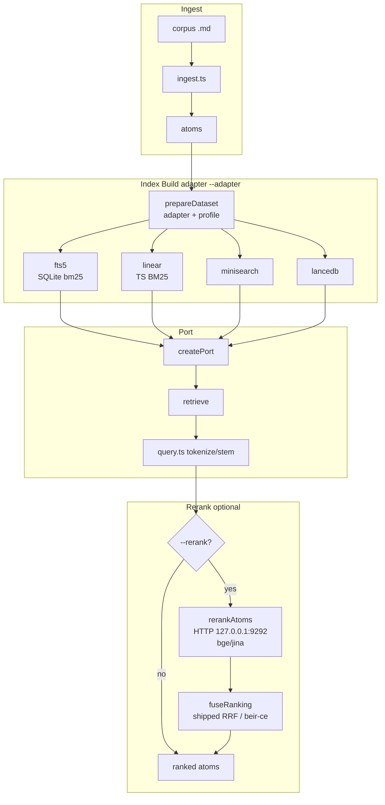

<!-- LLM-PRIMARY: THE retrieval path — the prose flow, the stage contracts, then the same path typed hop by hop, plus where the stemmer, tokenizer, BM25 and each index artifact actually live. Read this to decide WHICH hop and WHICH file a change belongs to. Sole owner of the pipeline description; GNOSIS-GUIDE.md owns the landmines, the measured state and what is settled. -->

# Gnosis Data Flow — the path

**This file is the single owner of the pipeline description.** § 0 states the path in prose with its stage contracts; § 1 types the same path hop by hop; §§ 2–5 name where each concern is implemented; § 6 routes a change to its hop.

`GNOSIS-GUIDE.md` owns what surrounds the path — the landmines, the measured state, the rerank constants and what has been ruled out. The user-facing CLI contract is `packages/gnosis/README.md`.

## 0. The path, in prose

**Query rephrasing is a SECOND optional network hop, before the first pass.** `retrieve --rephrase` (`rephrase.ts`) rewrites the question into a BM25 keyword line with a local chat model on the same llama-swap instance as the reranker, then retrieves — and reranks — with the rewrite; `query` is still reported as typed, with the rewrite beside it as `queryRewritten`. It is **opt-in and off by default**, so the default path is byte-identical to what every recorded number was measured on, and it is **cached on disk** by `(model, prompt version, query)` beside the index, so a repeated query costs no network. A refusal (server down / model not served / no usable line) retrieves with the RAW query and exits 3 — never silently.

**Routing:** Adapter is selected at `createPort` via `--adapter` CLI flag, default `fts5` on BOTH the CLI and the bench since `92d683e2` (they are asserted equal by `defaults.test.ts`); `openPort` rejects indexes prepared for a different adapter. `prepareDataset` is driven by the chosen adapter + dataset profile from `datasets.json` / `corpus-manifest.json` and writes a per-adapter artifact under its own parent dir. Query analysis is always `query.ts tokenize + stemText` / `stemmer` for all adapters. Rerank is gated by `--rerank` flag and server reachability at `RERANK_DEFAULT_URL http://127.0.0.1:9292`. When enabled, `rerankAtoms` calls a cross-encoder named by `--rerank-model` (default `qwen3-reranker-4b` since `92d683e2` — it IS the measured quality winner; `bge-reranker-v2-m3` was the default before that and every pre-`92d683e2` rerank row carries it); fusion is chosen by `--rerank-profile` `shipped` = RRF with `RERANK_RRF_K=20` / `RERANK_RRF_WEIGHT=0.75`, `beir-ce` = pure reranker order replacement. No deterministic rerank alternative exists — rerank is the only network hop in the RANKING path (`--rephrase` is the other one, and it sits before the first pass).

| Stage | Symbol | Contract |
|---|---|---|
| path exclusion | `isExcluded` → `loadCorpus` (`ingest.ts`) | Drops a source whose repo-relative path starts with any profile `excludePaths` prefix, **before read and chunk** — so an excluded file enters no count and no `skipped[]`. Directory prefixes MUST carry a trailing slash, or `startsWith` claims siblings |
| ingest | `ingest` (`ingest.ts`) | Chunks each source doc into atoms; `writeManifest` writes `corpus-manifest.json` to `dirname(outputDir)` |
| body dedupe | `bodyKey` / `firstByBody` (`ingest.ts`) | sha1 of the body with its heading line stripped (hashing the composed body would miss mirrors whose heading differs); bodies ≥ `DEDUPE_MIN_BODY_CHARS`. Keeps the FIRST by sorted source path, skips the rest with reason `duplicate-body-of:<id>`. Counted separately from `skipped` on `IngestSummary.duplicates` and in the manifest |
| id resolution | `duplicatesOf` → `resolveId` (`ingest.ts`) | O(n²); on collision it appends a fingerprint suffix and **NEVER discards** an atom |
| write guard | `roundTripError` (`validate.ts`) | Ingest MUST NOT write an atom its own parser refuses. Asks the parser (`parseAtom(serializeAtom(…))`) rather than re-checking fields, so it cannot drift. ~4.2 µs/atom |
| heading composition | `withHeading` (`chunker.ts`) → `bodyWithHeading` (`ingest.ts`) | A chunk starts *after* its heading line, then the heading is **re-added** — so a heading's terms ARE indexed. Exception: if the prefixed body would exceed `bodyMaxChars` the heading is dropped, the only case where they are genuinely unsearchable |
| empty-body drop | `emptyBodyReasons` (`ingest.ts`) | An atom whose body is empty after comment-stripping is discarded with a reason. It tests the **heading-stripped** chunk body, not the string the index reads — see § Settled |
| index build | per adapter, via `prepareDataset` | Each adapter gets the index IT needs; `openPort` REFUSES an index prepared for another adapter |
| port | `createPort(adapter, atomsDir, indexPath)` (`cli/adapter.ts`) | One bare port per adapter — JSON schema and exit codes cannot diverge per adapter |
| retrieve | `port.retrieve(rawQueryText, {k})` (`port.ts`) | Takes **RAW query text**; `toMatchExpression` (`fts5Adapter.ts`) tokenizes and stems |
| rerank | `rerankAtoms(query, atoms, baseUrl)` (`rerank.ts`) | Cross-encoder + fusion; refuses loudly when the server is down |

## 1. The hops

| # | Hop | Symbol (file) | In → Out |
|---|---|---|---|
| 1 | read source | `ingest` (`ingest.ts`) | path → `string` |
| 2 | chunk | `chunkMarkdown` (`chunker.ts`) | `string` → `readonly MarkdownChunk[]` |
| 3 | re-add heading | `bodyWithHeading` (`ingest.ts`) | `MarkdownChunk` → `string` |
| 4 | serialize | `serializeAtom` (`atom.ts`) | `AtomFrontmatter × string` → `string` |
| 5 | write + guard | `writeAtom` (`ingest.ts`), gated by `roundTripError` (`validate.ts`) | `string` → file on disk. The ONLY I/O hop, which is why it is absent from the all-`string` list below |
| 6 | parse | `parseAtom` (`atom.ts`) | `string` → `ParseAtomResult` → `Atom` |
| **7** | **analyze — INDEX side** | § 2 — four implementations | `string` → `string` \| `readonly string[]` |
| 8 | build index | § 4 — four artifacts | → `.db` \| Lance table \| JSON \| `CorpusScan` |
| 9 | CLI query | `runRetrieveCommand` (`cli/retrieveCommand.ts`) | → `string` (RAW; `buildQuery` has NO caller) |
| **10** | **port** | `KnowledgePort.retrieve` (`port.ts`) | `string × RetrieveOptions` → `RetrievalResult` |
| **11** | **analyze — QUERY side** | § 2 — same four, again | `string` → adapter-specific |
| 12 | score | § 3 — four BM25 implementations | → `readonly RetrievedAtom[]` |
| 13 | result | per adapter | → `RetrievalResult {atoms, mode, indexState}` |
| 14 | rerank (opt) | `rerankAtoms` (`rerank.ts`) | RAW query again × atoms → `RerankOutcome` |
| 15 | fuse | `fuseRanking` (`rerank.ts`) | → `readonly FusedItem<T>[]` |
| 16 | budget | `applyBudget` (`cli/retrieveCommand.ts`) | → `BudgetedResult` |
| 17 | render | text \| json \| xml | → `CommandOutcome` |

**Hops 1, 3, 4, 6, 7, 9, 10, 11 are ALL `string`.** No type distinguishes raw markdown / atom body / analyzed text, nor raw query / analyzed query. Branding that state: `claude-artifacts/standards/TS-BRANDED-TYPES.md`.

**Hops 7 and 11 are ONE operation at two points, implemented FOUR times** — because hop 10 passes `string`, so every adapter re-analyzes. The `KnowledgePort` docstring says *"query construction lives ABOVE the port, never inside an adapter"*, yet ANALYSIS lives inside all four. The "single stemmer" is a convention four files honour, not a structure: a change to hop 7 MUST be mirrored in hop 11 for every adapter, and nothing enforces it.

## 2. Analysis — the stemmer and the tokenizers (hops 7 + 11)

**Owner:** `query.ts` — `tokenize`, `TermProcessor`, `stemTerm`, `stemText`. Every adapter imports from here; none defines its own stemmer.

**The chain is data, not a function body.** `Stage = (tokens: readonly string[]) => readonly string[]`; text enters as `[text]` and `analyze` reduces the stages, so order is a config edit. Four named chains in `ANALYZERS`:

| Id | Stages | Use |
|---|---|---|
| `porter-fold` | split · lowercase · fold · stem | **DEFAULT — today's behaviour, bit-identical** |
| `porter-nofold` | split · lowercase · stem | isolates folding |
| `nostem-fold` | split · lowercase · fold | isolates stemming |
| `nostem-nofold` | split · lowercase | neither |

`splitTokens` admits `\p{M}` where `tokenize`'s `NON_WORD_RE` does not: `tokenize` folds BEFORE splitting, a chain splits FIRST, and without admitting marks a decomposed `café` would fragment mid-word. `foldTokens` drops the stranded marks. MUST NOT "simplify" that class back.

| Symbol | Does |
|---|---|
| `tokenize` | lowercase → NFD diacritic fold → split on `[^\p{L}\p{N}]+`. **Three responsibilities in one function**, and folding is unconditionally BEFORE stemming. Kept for the three adapters that still call it |
| `stemTerm` | Porter (1980) via npm `stemmer` — **English only**, applied to every adapter and every language |
| `stemText` | `tokenize(text).map(stemTerm).join(' ')` — equals `analyzeToText(text, 'porter-fold')`, proven over 300 real bodies |
| `analyze` / `analyzeToText` | Run a NAMED chain; default `porter-fold` |

| Adapter | Hop 7 (index side) | Hop 11 (query side) |
|---|---|---|
| `fts5` | `analyzeToText(body, analyzer)` in `writeEntries`; the id is **stamped into `index_meta`** in the same transaction | `toMatchExpression` per WHITESPACE CHUNK, with the id **READ BACK from the stamp** — `Fts5AdapterOptions` has NO analyzer field, so the query side cannot be told, only derived. Missing stamp = `porter-fold` (the only chain that ever existed); unknown stamp fails loudly |
| `lancedb` | `stemText(entry.body)` into `BODY_FIELD` | `stemText(query)` |
| `linear` | `tokenize(title + body).map(processTerm)` | `queryTerms` — `tokenize(query).map(processTerm)` |
| `minisearch` | MiniSearch `processTerm` option = `stemTerm` — the library applies it on both sides | same |

**Two tokenizers run in series on `fts5` and `lancedb`.** Ours runs first (inside `stemText`), then the engine's own runs over the already-stemmed output: SQLite `unicode61` for fts5, and Lance's `baseTokenizer:'simple'` for lancedb. Both engines have their own stemmers **deliberately disabled** — fts5 keeps `unicode61` rather than its bundled `porter`, and lancedb sets `stem:false`, `asciiFolding:false`, `removeStopWords:false` — precisely so `query.ts` stays the ONLY stemmer. MUST NOT enable an engine-side stemmer; it reintroduces a second, invisible analyzer.

`linear` is the only adapter with a swappable analyzer today (`processTerm?` option, defaulting to `stemTerm`); `minisearch` accepts one too. `fts5` and `lancedb` hard-import `stemText` — but the call is JS-side, **not** a SQLite or Lance constraint.

## 3. BM25 — four implementations, not one

| Adapter | Implementation | k1 / b | Indexed text |
|---|---|---|---|
| `fts5` | SQLite built-in `bm25(atom_fts)` | 1.2 / 0.75 **compiled into SQLite**, no setter exists | **Seven columns** (`FTS_COLUMNS`, `config.ts`): the atom body in `body`, plus six enrichment columns that are EMPTY unless an `--enrichment` sidecar was merged at build time. Body-only by WEIGHT, not by schema — `DEFAULT_FIELD_WEIGHTS` ships every enrichment column at 0. **Corrected 2026-08-25**: this cell read "`atom.body` only", true only before the enrichment schema landed |
| `linear` | Own TS — `scoreTerm`, `lengthNorm`, `idf` | `BM25_K1=1.2` / `BM25_B=0.75`, **overridable** per instance via `Bm25Params` | `frontmatter.title` + `atom.body` |
| `minisearch` | MiniSearch's own | its own defaults; boost / fuzzy / prefix all unset | `BODY_FIELD` |
| `lancedb` | Lance/Tantivy FTS | its own | `BODY_FIELD` |

`linear`'s formula, the only one written in this repo:

| Part | Form |
|---|---|
| IDF | `ln(1 + (N − df + 0.5) / (df + 0.5))`, smoothing from `BM25_IDF_SMOOTHING` (`config.ts`) |
| Length norm | `1 − b + b × length / avgLength`, where `length` = **token count** |
| Term score | `weight × freq × (k1 + 1) / (freq + k1 × norm)` |

**The same IDF formula is written twice** — `idf` in `query.ts` (private, reached only by `buildQuery`, which has NO production caller) and again in `linearScanAdapter.ts`. Only the constant is shared. Changing one does not change the other.

**MUST NOT read an adapter delta as a scorer delta** — they differ in parameters, tokenizer AND indexed text simultaneously. See `GNOSIS-GUIDE.md` § Adapters.

## 4. Index artifacts — what hop 8 actually writes

| Adapter | Artifact | Persisted | Shape |
|---|---|---|---|
| `fts5` | SQLite file at `indexPath` | disk | `atom_meta(rowid, id, path)` + `atom_fts` VIRTUAL `fts5(<FTS_COLUMNS>, content='', detail=full)` — **seven** columns, composed from `FTS_COLUMNS` by `CREATE_FTS_SQL` (`fts5Adapter.ts`) and never written as a literal list — + `index_meta(key, value)` carrying the analyzer id |
| `linear` | `CorpusScan {docs, avgLength, docFreq}` | **memory only** | rebuilt per retrieve unless `cacheCorpusScan` |
| `minisearch` | MiniSearch `toJSON` / `loadJSON` | disk | loaded, **never rebuilt in-process** |
| `lancedb` | Lance table + FTS index | disk dir | `BODY_FIELD`, `FTS_INDEX_OPTIONS` |

**`content=''` makes the fts5 table CONTENTLESS** — it stores the index, never the text. That is why the port rule says the returned `body` MUST be re-read from disk at call time: the index structurally cannot return it. `detail=full` keeps positions, which is what makes phrase queries work.

`atom_meta.rowid` = insertion order (`index + 1`), joined to `atom_fts.rowid`. `buildFts5Index` rebuilds **wholesale** so the same corpus always yields the same rowids, hence the same ranking.

**Ordering:** `bm25()` returns MORE NEGATIVE for a better match, so plain ASC is best-first. Bare `bm25()` ties are non-deterministic → `ORDER BY bm25(atom_fts), m.rowid`, then the port re-tiebreaks `(score DESC, atomId ASC)` so every adapter orders identically.

## 5. Freshness — every staleness check is mtime-based

| Check | Symbol | Predicate |
|---|---|---|
| fts5 index state | `resolveState` / `isStale` | index file `mtimeMs` vs newest atom `mtimeMs` (sampled at most once per adapter instance) |
| fts5 handle cache | handle key | `inode:mtimeMs:size` |
| linear scan cache | `isFresh` | `{count, newestMtimeMs}` **plus `processTerm` by function REFERENCE** |

`IndexState` = `unavailable` (no index — **NO search ran**, exit 3) · `stale` · `empty` (count 0) · `ready`. MUST NOT read `unavailable` as "no matches".

**None of these hash content.** A same-second edit, a checkout restoring an older mtime, or a swap preserving count and newest-mtime serves a stale index silently — the defect class behind the stale atom cache and the ghost documents in § Landmines.

## 6. Deciding the route

| I want to… | Hop | Where | Gotcha |
|---|---|---|---|
| Add or reorder an analysis step | 7 + 11 | `ANALYZERS` in `query.ts` | A chain is data — add the `Stage`, name the chain. `fts5` picks it up via the stamp; the other three still hard-call `stemText` |
| Measure an analyzer arm | — | `npm run gnosis:bench -- --analyzer <id>` | **`fts5` only** — refused on other adapters, because they would analyze with their own chain under your label |
| Change what the LEGACY helpers do (`tokenize` / `stemText`) | 7 AND 11 | `query.ts` + `linear`, `minisearch`, `lancedb` | Rebuild every index; update `isFresh`; engine-side stemmers MUST stay off. `fts5` no longer calls them |
| Make the OTHER adapters analyzer-aware | 7, 10, 11 | `port.ts` first | The port passes `string`, which is WHY analysis is duplicated 4× — fix the port signature, not each adapter |
| Tune k1 / b | 12 | `linearScanAdapter.ts` only | `fts5` compiles them in; `minisearch` / `lancedb` expose their own, unrelated knobs |
| Weight a non-`body` field differently | 8 + 12 | `FTS_COLUMNS` / `DEFAULT_FIELD_WEIGHTS` (`config.ts`) | **Corrected 2026-08-25** — this row read *"impossible without a schema change, the table is single-column"*. That schema change has landed: seven columns exist and `--field-weights` merges over the body-only default, so column weighting is a flag, not a rebuild. What is still NOT a column is the atom TITLE — `linear` tokenizes `frontmatter.title` and `fts5` does not, which is one reason the two disagree |
| Change the IDF | 12 | `linearScanAdapter.ts` | The copy in `query.ts` is dead for retrieval; changing it alone changes NOTHING |
| Change phrase behaviour | 11 | `toMatchExpression` | It analyses PER whitespace chunk so `adr-018` stays an adjacency phrase. Flattening to one term list silently degrades phrases to bag-of-words |
| Change query construction / rephrasing | **9 only** | `buildQuery`, and `packages/gnosis/README.md` § Query rephrasing | `buildQuery` has no production caller — the rule lives with the CALLER, not the engine |
| Change the rerank protocol | 14-15 | `RERANK_FUSION_PRESETS` (`config.ts`) | `K_INIT` and the URL are NOT caller-settable |
| Add an adapter | 10 | implement `KnowledgePort` | It MUST re-analyze identically, and nothing checks that it does |
| Debug "no results" | 13 | `indexState` first | `unavailable` means nothing was searched — never "no matches" |
| Make retrieval faster | 12 | already `fts5` | `linear` re-reads the corpus per retrieve and is not a production candidate |
